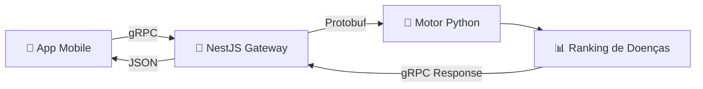

# 🗺️ Motor de Diagnóstico — Mapa Geral

> [!tip] 📌 Comece por aqui!
> Esta é a **página central** de toda a implementação Python. Use os links abaixo para navegar.

---

## 🧩 O que é o Motor?

Um **microserviço Python** que recebe sintomas de um paciente e devolve uma **lista de doenças rankeadas por probabilidade**.

---

## 📂 Páginas de Estudo

Siga esta ordem de leitura 👇

| # | Página | O que aprendo? |
|---|--------|---------------|
| 1 | [[01 — Visão Geral da Arquitetura]] | Como as peças se encaixam |
| 2 | [[02 — Modelos de Dados (Pydantic)]] | Disease, Symptom, Link |
| 3 | [[03 — Base de Conhecimento]] | De onde vêm os dados médicos |
| 4 | [[04 — Matemática Bayesiana]] | Log-Odds, Noisy-OR, LR+/LR- |
| 5 | [[05 — TF-IDF e Espaço Vetorial]] | Como o texto vira números |
| 6 | [[06 — NLP com scispaCy]] | Extração de sintomas do texto |
| 7 | [[07 — gRPC e Comunicação]] | Como o NestJS conversa com o Python |
| 8 | [[08 — Como Rodar e Testar]] | Comandos práticos |

---

## 🔑 Conceitos-Chave (Mini Glossário)

| Termo | Significado simples |
|-------|-------------------|
| **CUI** | Código único de um conceito médico (ex: `C0015967` = Febre) |
| **LR+** | Quanto MAIS provável é o sintoma se a doença existe |
| **LR-** | Quanto MENOS provável é o sintoma se a doença NÃO existe |
| **Prior** | Probabilidade base de ter a doença (antes de ver sintomas) |
| **Posterior** | Probabilidade DEPOIS de considerar os sintomas |
| **Noisy-OR** | Forma de combinar múltiplas causas sem explodir em cálculos |
| **TF-IDF** | Técnica que valoriza sintomas raros e penaliza os comuns |
| **gRPC** | Protocolo de comunicação ultrarrápido entre serviços |

---

## 📊 Status do Projeto

- [x] Algoritmos matemáticos (Bayesian + TF-IDF)
- [x] Base de conhecimento (12 doenças, 30 sintomas)
- [x] Modelos Pydantic com validação
- [x] NLP com scispaCy
- [x] gRPC compilado e funcional
- [x] 67 testes passando ✅
- [ ] Detecção de negação ("sem febre")
- [ ] LLM para contextualização
- [ ] Docker
- [ ] Neo4j / PostgreSQL
