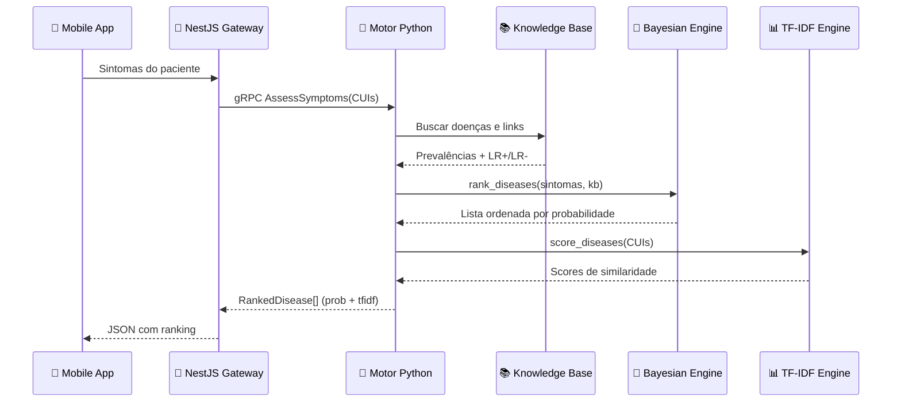

# 🏗️ Visão Geral da Arquitetura

> [!abstract] Em uma frase
> O motor Python é um **servidor gRPC** que recebe sintomas, consulta uma **base de conhecimento médico**, e calcula probabilidades usando **Bayes + TF-IDF**.

---

## 📦 Estrutura de Pastas

```
diagnostic-engine/
├── 📁 data/                    ← Dados médicos (JSON)
│   ├── diseases.json           ← 12 doenças
│   ├── symptoms.json           ← 30 sintomas
│   └── disease_symptom_links.json  ← 55 relações
│
├── 📁 proto/
│   └── diagnostic.proto        ← Contrato gRPC
│
├── 📁 src/
│   ├── 📁 data/
│   │   └── knowledge_base.py   ← Carrega os JSONs
│   ├── 📁 grpc/
│   │   ├── diagnostic_service.py  ← Implementação RPC
│   │   └── 📁 generated/       ← Stubs compilados
│   ├── 📁 math/
│   │   ├── bayesian_network.py ← Noisy-OR + Log-Odds
│   │   └── vector_space.py     ← TF-IDF + Cosseno
│   ├── 📁 models/
│   │   ├── disease.py          ← Modelo de Doença
│   │   ├── symptom.py          ← Modelo de Sintoma
│   │   └── disease_symptom_link.py ← Relação com LR+/LR-
│   ├── 📁 nlp/
│   │   └── extractor.py        ← scispaCy NER
│   └── main.py                 ← Entry point do servidor
│
├── 📁 tests/                   ← 67 testes ✅
└── pyproject.toml              ← Configuração Python
```

---

## 🔄 Fluxo de uma Requisição



---

## 🧠 As 4 Camadas

> [!info] Pense como uma cebola 🧅
> Cada camada só conversa com a camada adjacente.

| Camada | Responsabilidade | Arquivos |
|--------|-----------------|---------|
| **1. gRPC** | Receber/enviar dados | `diagnostic_service.py`, `main.py` |
| **2. Dados** | Carregar conhecimento médico | `knowledge_base.py`, `models/` |
| **3. Matemática** | Calcular probabilidades | `bayesian_network.py`, `vector_space.py` |
| **4. NLP** | Extrair sintomas do texto | `extractor.py` |

---

Próximo: [[02 — Modelos de Dados (Pydantic)]]
