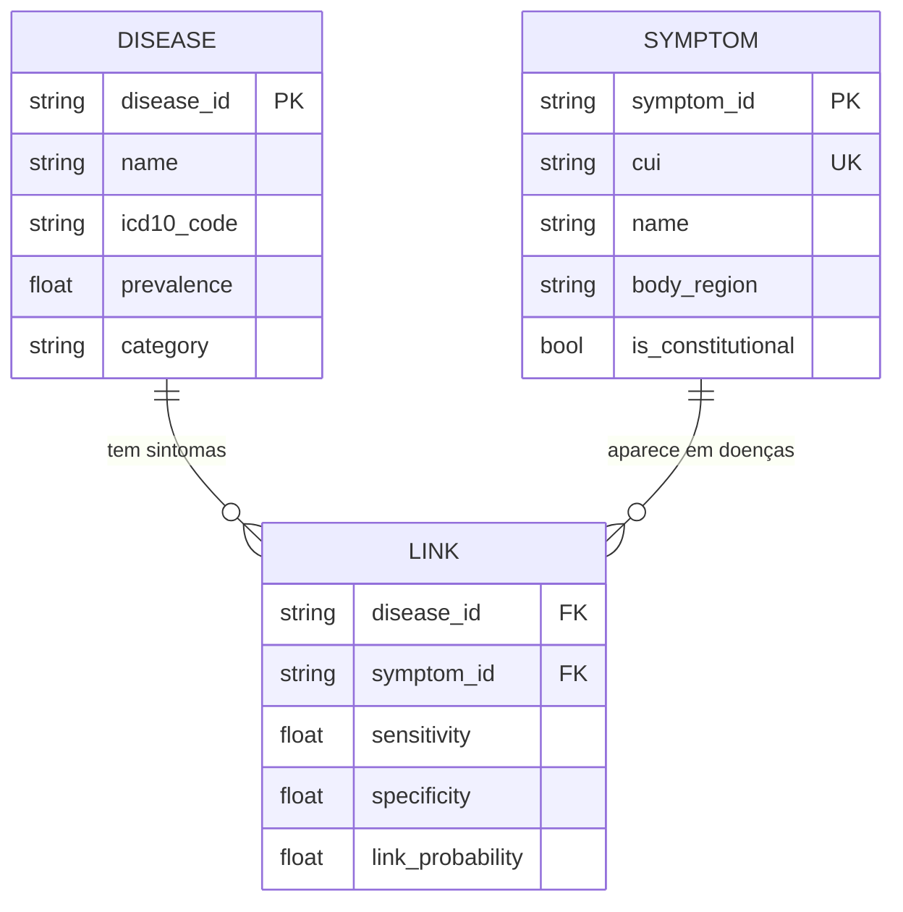
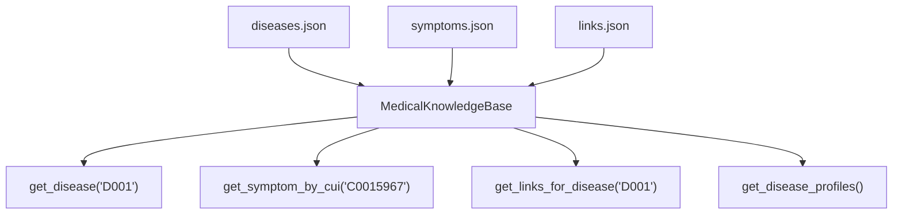

# 📚 Base de Conhecimento

> [!abstract] Em uma frase
> A base de conhecimento são **3 arquivos JSON** que contêm todas as doenças, sintomas, e a relação entre eles.

---

## 🗄️ Os 3 Arquivos

---

## 📊 Números Atuais

| Arquivo | Quantidade | Exemplo |
|---------|-----------|---------|
| `diseases.json` | ==14 doenças== | Faringite, Laringite, Pneumonia... |
| `symptoms.json` | ==31 sintomas== | Tosse, Febre, Rouquidão... |
| `disease_symptom_links.json` | ==70 links== | Rouquidão↔Laringite (sens=0.95) |

---

## 🏥 Doenças Incluídas

| ID | Doença | Categoria | Prevalência |
|----|--------|----------|-------------|
| D001 | Pneumonia Comunitária | 🫁 Respiratória | 2% |
| D002 | Gripe (Influenza) | 🫁 Respiratória | 8% |
| D003 | Bronquite Aguda | 🫁 Respiratória | 5% |
| D004 | Crise de Asma | 🫁 Respiratória | 4% |
| D005 | Infarto (IAM) | ❤️ Cardiovascular | 0.5% |
| D006 | Refluxo (DRGE) | 🟡 GI | 15% |
| D007 | Gastroenterite | 🟡 GI | 6% |
| D008 | Cefaleia Tensional | 🧠 Neurológica | 30% |
| D009 | Enxaqueca | 🧠 Neurológica | 12% |
| D010 | Infecção Urinária | 🟣 Genitourinária | 3% |
| D011 | Anemia Ferropriva | 🔴 Hematológica | 5% |
| D012 | Depressão Maior | 💜 Psiquiátrica | 7% |
| D013 | Faringite Aguda | 🫁 Respiratória | 12% |
| D014 | Laringite Aguda | 🫁 Respiratória | 3% |

---

## 🔧 Como a Knowledge Base Funciona

📄 Arquivo: `src/data/knowledge_base.py`

> [!tip] Pense como um bibliotecário 📖
> Ele carrega todos os livros (JSONs) e cria **índices** para encontrar qualquer informação em O(1).

### Métodos Principais

| Método | O que faz | Quem usa |
|--------|----------|---------|
| `get_disease(id)` | Busca doença por ID | gRPC Service |
| `get_symptom_by_cui(cui)` | Busca sintoma pelo CUI | Pipeline NLP |
| `get_links_for_disease(id)` | Todos os links de uma doença | Motor Bayesiano |
| `get_disease_profiles()` | Mapa doença→CUIs | Motor TF-IDF |
| `resolve_cuis_to_symptom_ids(cuis)` | Converte CUIs em IDs | gRPC Service |

---

## 🔮 Futuro: Neo4j + PostgreSQL

> [!info] Por que JSON agora?
> Mais simples de iterar durante o desenvolvimento com TDD.
> A interface `KnowledgeBaseProtocol` já está preparada para trocar por Neo4j/PostgreSQL sem mudar nenhum código do motor.

---

Anterior: [[02 — Modelos de Dados (Pydantic)]] | Próximo: [[04 — Matemática Bayesiana]]
