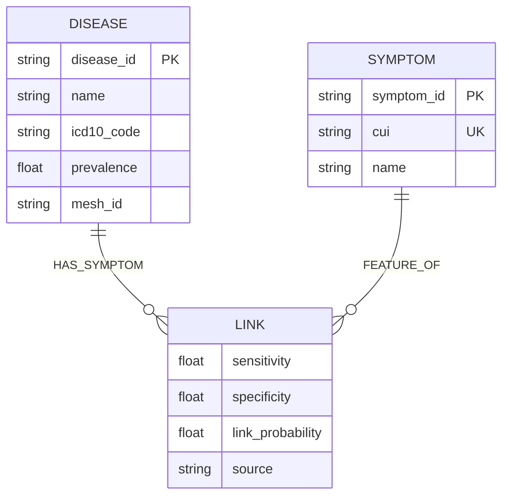
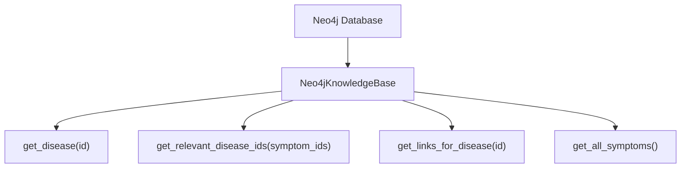

# 📚 Base de Conhecimento (Grafo de Conhecimento)

> [!abstract] Em uma frase
> A base de conhecimento evoluiu de arquivos JSON para um **Grafo de Conhecimento no Neo4j**, integrando UMLS, HSDN e MeSH em uma estrutura de altíssima performance.

---

## 🕸️ Estrutura do Grafo (LPG)



---

## 📊 Números de Produção

| Entidade | Quantidade | Fonte |
|---------|-----------|---------|
| **Doenças** | ==26.380 nodes== | HSDN, MeSH, WikiData |
| **Sintomas** | ==347 nodes== | UMLS (CUIs Normalizados) |
| **Relacionamentos** | ==10.535 links== | PubMed Mining, SymMap |

---

## 🏥 Exploração de Dados (Neo4j)

> [!tip] Query Útil (Cypher)
> Para ver os sintomas de uma doença específica:
> ```cypher
> MATCH (d:Disease {name: "Acute Pharyngitis"})-[r:HAS_SYMPTOM]->(s:Symptom)
> RETURN s.name, r.link_probability ORDER BY r.link_probability DESC
> ```

---

## 🔧 Como a Knowledge Base Funciona

📄 Arquivo: `src/data/neo4j_knowledge_base.py`

> [!important] Abstração com Protocolos
> O motor não sabe que o banco é Neo4j. Ele usa o `KnowledgeBaseProtocol`. Isso permitiu a migração sem quebrar a matemática!



### Métodos de Alta Performance

| Método | O que faz | Otimização |
|--------|----------|---------|
| `get_relevant_disease_ids` | Filtra doenças candidatas | Usa travessia de grafo (1-hop) |
| `resolve_cuis_to_symptom_ids` | Mapeia CUIs para IDs | Cache interno no driver |
| `get_all_symptoms` | Lista sintomas para o NLP | Filtragem de CUIs malformados |

---

## 🔗 Integração de Dados

A base é alimentada pelo script `scripts/enrich_knowledge_base.py`, que cruza as relações do dataset HSDN com os identificadores do MeSH, garantindo que o motor tenha uma visão global da medicina moderna.

---

Anterior: [[02 — Modelos de Dados (Pydantic)]] | Próximo: [[04 — Matemática Bayesiana]]
