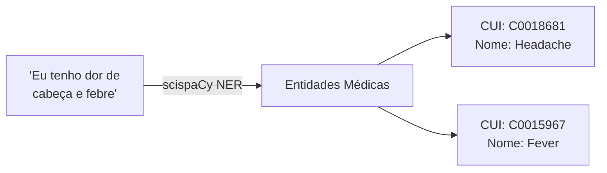
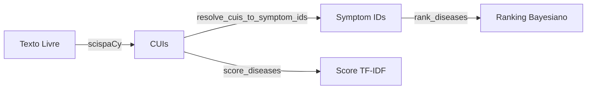

# 🔤 NLP com scispaCy

> [!abstract] Em uma frase
> O scispaCy lê texto livre ("eu tenho dor de cabeça e febre") e extrai os **CUIs** dos sintomas médicos.

---

## 🎯 O Que Faz



📄 `src/nlp/extractor.py`

---

## 🧠 NER = Named Entity Recognition

> [!tip] Analogia: Marca-texto 🖍️
> Imagine que alguém passa um marca-texto automático no texto,
> destacando APENAS os termos que são sintomas médicos.

| Texto do Paciente | O que o NER encontra |
|-------------------|---------------------|
| "Eu tenho **dor de cabeça** forte" | `Headache` → `C0018681` |
| "Sinto muita **febre** e **tosse**" | `Fever` → `C0015967`, `Cough` → `C0010200` |
| "Estou bem, sem queixas" | *(nada encontrado)* |

---

## 🔧 Como Usar

```python
extractor = ClinicalExtractor()
features = extractor.extract_features("headache and fever")

# Resultado:
# [
#   {"cui": "C0018681", "name": "headache", "is_present": True},
#   {"cui": "C0015967", "name": "fever", "is_present": True}
# ]
```

---

## ⚠️ Limitação Atual

> [!warning] Negação NÃO é detectada ainda
> Se o paciente diz **"não tenho febre"**, o sistema atual marca febre como **presente** ❌
>
> Isso será resolvido com **NegEx/Negation Detection** numa fase futura.

---

## 🔗 Conexão com o Resto



---

Anterior: [[05 — TF-IDF e Espaço Vetorial]] | Próximo: [[07 — gRPC e Comunicação]]
