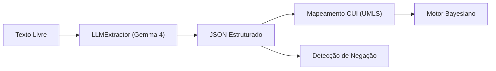

# 🤖 NLP e Extração com LLM

> [!abstract] Em uma frase
> Transformamos o texto livre do paciente em dados estruturados (CUIs e Negação) usando o **Gemma 4 31B**.

---

## 🚀 Arquitetura de Extração

A extração não é mais baseada apenas em palavras-chave ou regras rígidas. Utilizamos um modelo de linguagem de grande porte (LLM) para entender o **contexto clínico**.



---

## 🧠 Gemma 4 31B (via Google GenAI SDK)

Implementamos o `LLMExtractor` que utiliza o modelo Gemma para extrair:
- **Presença/Ausência**: Identifica se o sintoma é afirmado ou negado (Ex: "Não tenho febre" ➡️ `is_present: false`).
- **Mapeamento CUI**: O prompt envia "hints" da Base de Conhecimento para garantir que a LLM use os CUIs corretos (ex: `C0037763` para Sore Throat).
- **Contexto**: Extração de duração, gravidade e fatores de risco.

📄 Arquivo: `src/nlp/llm_extractor.py`

---

## 🛡️ Fallback Estratégico (scispaCy)

Caso a API do Google esteja indisponível ou a chave não esteja configurada, o sistema reverte automaticamente para o **scispaCy** (`en_core_sci_sm`).

1. **Camada 1 (LLM)**: Alta fidelidade, entende português/inglês e negação.
2. **Camada 2 (scispaCy)**: NER médico básico para identificar entidades.
3. **Camada 3 (Keywords)**: Última instância de busca literal.

📄 Arquivo: `src/nlp/extractor.py`

---

## 🛠️ Exemplo de Processamento

**Input:**
> "Estou com dor de garganta intensa há 2 dias. Não tenho febre."

**Output Estruturado:**
```json
{
  "symptoms": [
    { "cui": "C0037763", "name": "Sore Throat", "is_present": true, "confidence": 0.98 },
    { "cui": "C0015967", "name": "Fever", "is_present": false, "confidence": 1.0 }
  ],
  "context": {
    "duration": "2 days",
    "severity": "intense"
  }
}
```

---

## ⚙️ Configuração

Para o extrator funcionar, é necessário:
1. Variável `GEMINI_API_KEY` no arquivo `.env`.
2. SDK `google-genai` instalado.

---

Anterior: [[05 — TF-IDF e Espaço Vetorial]] | Próximo: [[07 — gRPC e Comunicação]]
