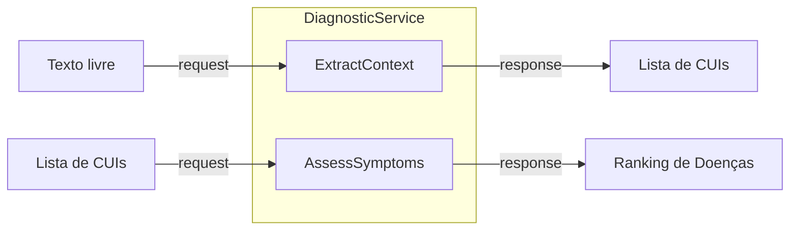

# 📡 gRPC e Comunicação

> [!abstract] Em uma frase
> O gRPC é o **telefone** entre o NestJS (Node.js) e o Motor Python — ultrarrápido e tipado.

---

## 🤔 Por que gRPC e não REST?

| | REST (HTTP/JSON) | gRPC (HTTP/2 + Protobuf) |
|---|---|---|
| Velocidade | 🐢 Lento | 🚀 ==10x mais rápido== |
| Tipagem | ❌ Nenhuma | ✅ Contrato `.proto` |
| Serialização | JSON (texto) | Protobuf (binário) |
| Streaming | Limitado | Bidirecional |

---

## 📜 O Contrato `.proto`

📄 `proto/diagnostic.proto`

> [!info] O `.proto` é a "lei" 📋
> Tanto o NestJS quanto o Python devem obedecer este contrato.
> Se mudar o `.proto`, ambos precisam ser atualizados.

### 2 RPCs Disponíveis



---

### RPC 1: `ExtractContext`

| Campo | Tipo | Descrição |
|-------|------|-----------|
| **Input** | `free_text` (string) | Texto livre do paciente |
| **Output** | `features[]` | Lista de `{cui, name, is_present}` |

### RPC 2: `AssessSymptoms`

| Campo | Tipo | Descrição |
|-------|------|-----------|
| **Input** | `symptoms[]` | CUIs dos sintomas |
| **Output** | `ranked_diseases[]` | Lista ordenada com: |
| | `disease_id` | ID da doença |
| | `disease_name` | Nome legível |
| | `posterior_probability` | Probabilidade pós-teste |
| | `likelihood_ratio_positive` | LR+ médio |
| | `tf_idf_score` | Score TF-IDF |

---

## 🔧 Compilação do Proto

> [!tip] Sempre que mudar o `.proto`, recompile!

```bash
python scripts/compile_proto.py
```

Isso gera 2 arquivos em `src/grpc/generated/`:
- `diagnostic_pb2.py` — mensagens (tipos de dados)
- `diagnostic_pb2_grpc.py` — servicer (métodos RPC)

---

## 🖥️ O Servidor

📄 `src/main.py`

```bash
# Iniciar o servidor na porta 50051
python src/main.py
```

> [!success] O servidor carrega a Knowledge Base no `__init__` para que a primeira requisição já seja rápida.

---

Anterior: [[06 — NLP com scispaCy]] | Próximo: [[08 — Como Rodar e Testar]]
