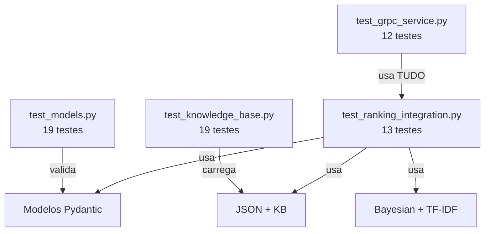

# ▶️ Como Rodar e Testar

> [!abstract] Em uma frase
> Todos os comandos práticos para instalar, rodar e testar o motor de diagnóstico.

---

## 🔧 Setup Inicial (uma vez só)

```bash
cd diagnostic-engine

# Criar ambiente virtual
python -m venv .venv

# Ativar (Windows)
.venv\Scripts\activate

# Instalar dependências
pip install -e ".[dev]"

# Compilar o protobuf
python scripts/compile_proto.py
```

> [!tip] O `.[dev]` instala tudo: pydantic, grpcio, pytest, etc.

---

## 🔑 Configuração de API (LLM)

Para rodar a extração semântica com o **Gemma 4 31B**, você precisa de uma chave de API:

1. Crie um arquivo `.env` na raiz da pasta `diagnostic-engine`.
2. Adicione sua chave:
   ```env
   GEMINI_API_KEY=sua_chave_aqui
   ```

---

## 🧪 Rodar os Testes

```bash
# Todos os testes (recomendado)
python -m pytest tests/ -v

# Só um arquivo específico
python -m pytest tests/test_grpc_service.py -v
```

### O que cada arquivo testa

| Arquivo de Teste | O que testa | Qtd |
|-----------------|------------|-----|
| `test_clinical_math.py` | Noisy-OR, Log-Odds, TF-IDF puro | 3 |
| `test_models.py` | Validação Pydantic (Disease, Symptom, Link) | 19 |
| `test_knowledge_base.py` | Carregamento JSON, lookups, resolução CUI | 20 |
| `test_ranking_integration.py` | Ranking Bayesiano + TF-IDF end-to-end | 13 |
| `test_nlp_pipeline.py` | Extração NLP com scispaCy | 1 |
| `test_grpc_service.py` | RPCs ExtractContext e AssessSymptoms | 12 |
| **Total** | | **68** ✅ |

---

## 🏥 Simulação Clínica End-to-End

Criamos um script que simula um caso real do início ao fim (Extração LLM ➡️ Diagnóstico):

```bash
python scripts/simulate_case.py
```

Este script testa:
1. Extração de texto livre (português/inglês).
2. Detecção de sintomas presentes e **negados**.
3. Cálculo de probabilidades e similaridade TF-IDF.

---

## 🖥️ Iniciar o Servidor gRPC

```bash
# Porta padrão 50051
python src/main.py

# Porta customizada
DIAGNOSTIC_PORT=8080 python src/main.py
```

> [!success] O servidor loga quando está pronto:
> ```
> Starting async gRPC Diagnostic Engine on [::]:50051
> Server started — waiting for requests...
> ```

---

## 🐛 Problemas Comuns

> [!bug]- `ModuleNotFoundError: No module named 'grpc_tools'`
> **Solução:** `pip install grpcio-tools`

> [!bug]- `ModuleNotFoundError: No module named 'diagnostic_pb2'`
> **Solução:** `python scripts/compile_proto.py`

> [!bug]- `ModuleNotFoundError: No module named 'pydantic'`
> **Solução:** `pip install -e ".[dev]"`

> [!bug]- Warnings do Pylance no VS Code
> **Solução:** `Ctrl+Shift+P` → "Python: Select Interpreter" → `.venv`

---

## 📁 Estrutura de Testes



> [!important] Os testes formam uma pirâmide
> - **Base:** Modelos e dados (38 testes) — rápidos
> - **Meio:** Integração matemática (13 testes)
> - **Topo:** gRPC end-to-end (12 testes) — mais lentos

---

Anterior: [[07 — gRPC e Comunicação]] | Voltar: [[00 — Mapa Geral]]
