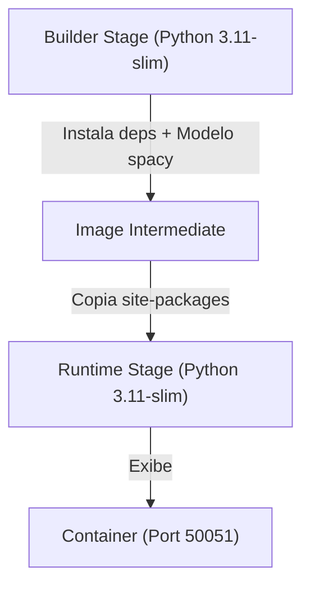

# 🐳 Docker e Infraestrutura

> [!abstract] Em uma frase
> O motor de diagnóstico é conteinerizado para garantir consistência entre desenvolvimento e produção, com suporte a **Hot Reload**.

---

## 🏗️ Arquitetura Docker

O projeto utiliza **Multi-stage Builds** para otimizar o tamanho da imagem e o tempo de inicialização.



### Otimizações Aplicadas:
- **Tamanho Reduzido**: A imagem final contém apenas o necessário para execução, sem ferramentas de compilação.
- **Pre-download**: O modelo `en_core_sci_sm` é baixado durante o build, eliminando latência no startup.
- **Camadas de Cache**: Mudanças no código não invalidam a camada de dependências (pip install).

---

## 🔥 Hot Reload (Desenvolvimento)

Para acelerar o desenvolvimento, o `docker-compose.yml` mapeia a pasta local para dentro do container e usa o **Watchdog**.

📄 Arquivo: `docker-compose.yml`

```yaml
volumes:
  - ./diagnostic-engine:/app
command: watchmedo auto-restart --directory=./src ...
```

> [!tip] Como funciona?
> Sempre que você salva um arquivo `.py` ou `.json` no seu editor, o container detecta a mudança e reinicia o servidor gRPC automaticamente em menos de 1 segundo.

---

## ⚙️ Variáveis de Ambiente

O Docker carrega automaticamente as variáveis do arquivo `.env` localizado em `diagnostic-engine/.env`.

| Variável | Descrição |
|----------|-----------|
| `GEMINI_API_KEY` | Chave para extração semântica com Gemma 4 31B |
| `DIAGNOSTIC_PORT` | Porta do servidor gRPC (Default: 50051) |
| `PYTHONUNBUFFERED` | Garante que os logs apareçam em tempo real no console |

---

## 🚀 Comandos Úteis

| Comando | O que faz |
|---------|-----------|
| `docker-compose up --build` | Constrói e sobe o motor com hot reload |
| `docker-compose down` | Para e remove os containers |
| `docker-compose logs -f` | Acompanha os logs em tempo real |
| `docker exec -it diagnostic-engine bash` | Entra no terminal do container |

---

Anterior: [[08 — Como Rodar e Testar]] | Voltar: [[00 — Mapa Geral]]
