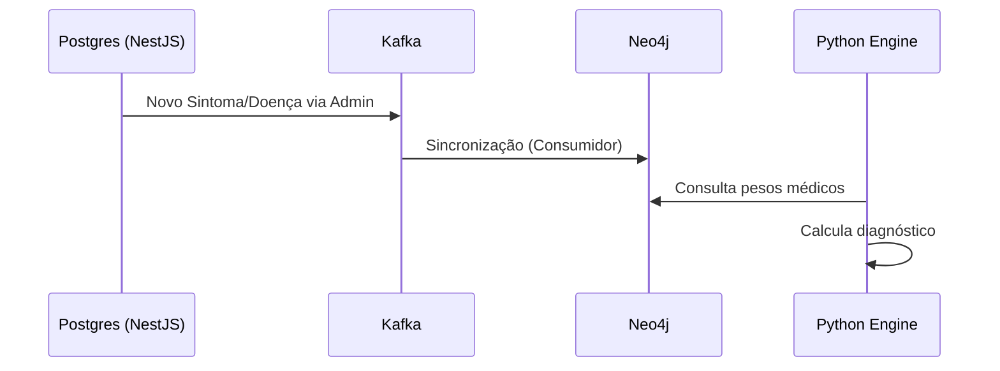

# 🏗️ Implementação e Entidades

> [!abstract] Em uma frase
> Esta é a planta de como os dados são divididos: o **Postgres** cuida das pessoas, o **Neo4j** cuida da medicina e o **Python** une os dois.

---

## 📐 Distribuição de Entidades

> [!tip] Regra de Ouro
> Dados que mudam pouco e têm muitas relações -> **Neo4j**.
> Dados que mudam muito e são fatos isolados -> **Postgres**.

### 🕸️ Neo4j (Conhecimento Médico)
*   `Disease`: Nome, Descrição, CUI (UMLS).
*   `Symptom`: Nome, CUI, Localização anatômica.
*   `Association`: ==Onde a mágica acontece==. Relação com `sensitivity`, `specificity` e `log_odds`.
*   `Category`: Hierarquia de especialidades (ex: Infectologia).

### 🐘 PostgreSQL (Dados do Paciente)
*   `User/Patient`: Dados pessoais e identificação.
*   `RiskFactors`: O que o paciente já tem (Diabetes, Fumante).
*   `Consultation`: ==O registro histórico== da triagem.

---

## 🐍 Interação do Motor Python

O motor Python é **Stateless** (não guarda estado):

1.  **Leitura do Conhecimento:** Conecta ao **Neo4j** para buscar os pesos Bayesianos.
2.  **Cálculo sob demanda:** Ele recebe os dados do paciente via **gRPC** (enviados pelo NestJS).
3.  **Independência:** O Python não precisa saber "quem" é o paciente, apenas quais são os sintomas.

---

## 🔄 Fluxo de Sincronização

> [!info] Como o Grafo se mantém atualizado?
> Usamos o padrão **Change Data Capture (CDC)** com Kafka.

---

Anterior: [[02 — Conceitos PostgreSQL]] | Voltar para: [[00-Index]]
