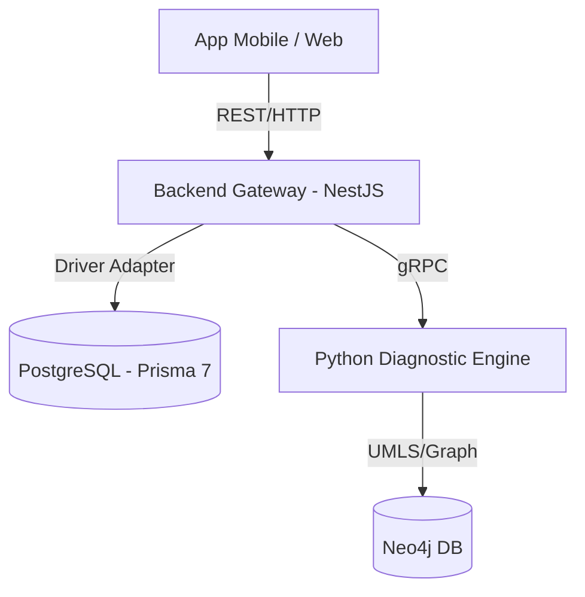

# 00 - Mapa Geral do Backend Gateway (NestJS)

O **Backend Gateway** é o orquestrador central da plataforma médica. Ele atua como uma fachada (Facade) que isola a complexidade dos microserviços e do banco de dados (PostgreSQL) do mundo externo (Mobile App/Web).

## 🗺️ Visão Macro

## 🧩 Componentes Principais

### 1. Camada de Apresentação (Presentation)
- **Controllers**: Definem as rotas HTTP e validam as entradas (DTOs).
- **TriageController**: Gerencia o fluxo de sessões de triagem.
- **SymptomController**: Gerencia a sincronização e listagem de sintomas.

### 2. Camada de Aplicação (Application)
- **Use Cases**: Contêm a lógica de negócio pura e independente de frameworks.
- **SyncSymptomDictionary**: Orquestra a busca de sintomas no motor Python e atualização no DB.

### 3. Camada de Domínio (Domain)
- **Entities**: Objetos de negócio (ex: `TriageSession`, `Patient`).
- **Ports/Interfaces**: Definem os contratos para repositórios e clientes externos.

### 4. Camada de Infraestrutura (Infrastructure)
- **Database (Prisma)**: Implementação da persistência usando Prisma 7 e Driver Adapters.
- **gRPC**: Clientes para comunicação com o motor de diagnóstico Python.

## 🔄 Fluxos de Dados

1. **Sincronização de Sintomas**:
   - `HTTP POST /symptoms/sync` -> `UseCase` -> `gRPC Client (Python)` -> `Prisma Repository` -> `Postgres`.
2. **Início de Triagem**:
   - `HTTP POST /triage/start` -> `UseCase` -> `Entity (Creation)` -> `Prisma Repository` -> `Postgres`.

## 🛠️ Tecnologias Chave

- **Framework**: NestJS (v11+)
- **ORM**: Prisma (v7.8.0) com `@prisma/adapter-pg`
- **Banco**: PostgreSQL 16
- **Comunicação**: gRPC (@grpc/grpc-js)
- **Testes**: Vitest (Velocidade e ESM nativo)
- **Infra**: Docker & Docker Compose
