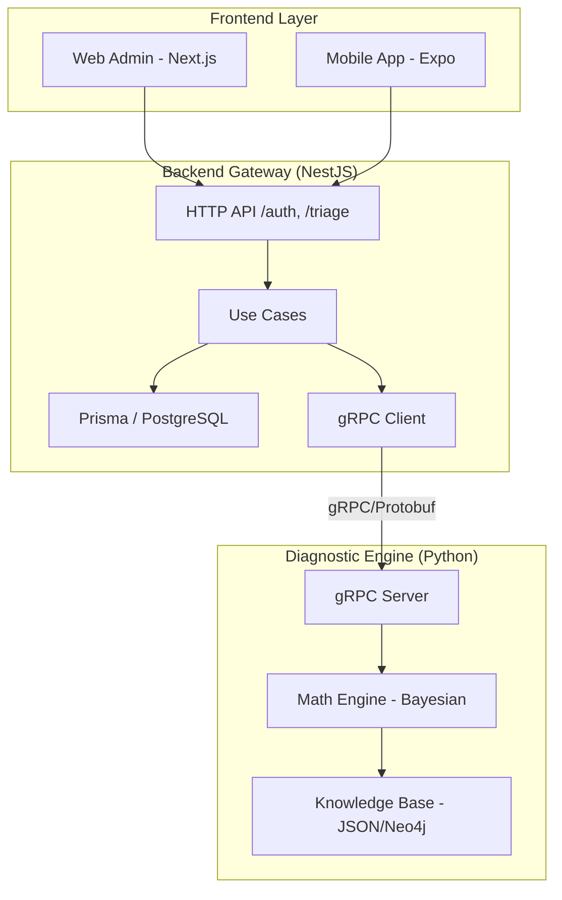

# 🎓 Principal-Level Architecture Guide

Este guia é destinado a engenheiros seniores e arquitetos que precisam entender as decisões fundamentais e os compromissos (trade-offs) do Projeto Médico.

## Core Architectural Insight
O sistema opera como um **Distribuidor de Inferência Híbrida**.
- **Gateway (TS)**: Gerencia o estado efêmero e a segurança (Clean Architecture).
- **Engine (PY)**: Gerencia o cálculo estocástico (Rede Bayesiana + TF-IDF).

A comunicação via **gRPC** foi escolhida sobre REST para garantir contratos tipados estritos (Protocol Buffers) e baixa latência na transferência de grandes vetores de sintomas.

## System Architecture

## Design Trade-offs
1. **Consistência vs Performance**: Utilizamos PostgreSQL para triagens (ACID) e Neo4j para o grafo de conhecimento médico, priorizando relações complexas sobre velocidade de escrita no KB.
2. **Duplicação de Tipos**: Optamos por manter DTOs separados no Gateway e Protobufs na Engine para evitar acoplamento direto de modelos de domínio entre linguagens.

## Strategic Direction
O próximo passo estratégico é a migração da `KnowledgeBase` local para um cluster Neo4j distribuído e a implementação de cache L2 no Gateway para sintomas frequentes.
